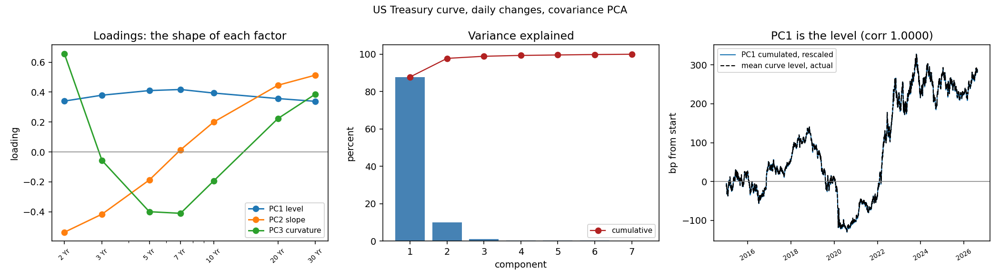

# Yield curve PCA, written from scratch

Principal component analysis of the US Treasury par yield curve, with the
decomposition implemented directly (`numpy.linalg` only) rather than called from a
library. `sklearn` appears in exactly one place, `scripts/validate.py`, where it is
used as an independent reference to check the from-scratch code is right.

The point of the repo is the mechanism, not the output. Everything here could be
produced in four lines with `sklearn.decomposition.PCA`. Writing the eigendecomposition
out is what turns "PCA reduces dimensionality" into something defensible under
questioning.

## Data

US Treasury daily par yield curve, downloaded from treasury.gov, 2 January 2015 to
17 August 2026: 2,907 observations across 11 tenors, no missing values.

Two panels are used, and the distinction matters more than expected:

- **coupon curve** (2Y, 3Y, 5Y, 7Y, 10Y, 20Y, 30Y), the object that curve factor
  statements are normally about
- **full panel**, the coupon curve plus the 1M, 3M and 6M bills

## Headline results

Covariance PCA on daily changes of the coupon curve, in basis points:

| component | daily sd (bp) | share | cumulative | shape |
|---|---|---|---|---|
| PC1 | 13.17 | 87.87% | 87.87% | level |
| PC2 | 4.42 | 9.92% | 97.79% | slope |
| PC3 | 1.49 | 1.13% | 98.91% | curvature |

The shape labels are not assigned by hand. `ycpca/curve.py` counts sign changes in each
loading vector: zero crossings is a level, one is a slope, two is a curvature.



**PC1 is verified to be the level, not merely described as one.** Cumulating the PC1
projection of raw curve changes and rescaling by the sum of its loadings reproduces the
actual average curve level with correlation 1.0000 and a maximum gap of 1.8 bp over
eleven years. That check is in `run_analysis.py`, and it failed the first two times it
was written, for reasons documented in the code.

### Three-factor hedge, tested out of sample

A book with DV01 of +50k at 2Y, -30k at 5Y, +40k at 10Y, -20k at 30Y, hedged with 2Y,
10Y and 30Y instruments by solving a 3x3 system that sets the first three factor
exposures to zero.

The number below is **walk-forward**, not in-sample. The loadings and the hedge are
solved on a 250-day training window, then held fixed over the following 21 days and
scored on days the estimator never saw. 126 non-overlapping blocks, 2,646
out-of-sample days from January 2016 to August 2026:

| hedge | daily P&L sd | variance removed |
|---|---|---|
| unhedged | $223,677 | |
| DV01-neutral only | $155,640 | 51.6% |
| three-factor PCA | $40,082 | 96.8% |
| **min-variance, no PCA at all** | **$33,920** | **97.7%** |

Duration-neutral removes half the risk. Three factors remove almost all of it, because
what is left is PC4 and beyond, which carry 1.09% of curve variance.

### The null model wins, and that is the honest headline

Solve the same hedge straight off the training covariance, `h = -(P'SP)^-1 P'S v`,
one linear solve with no eigendecomposition anywhere, and it removes **97.700%** against
the three-factor hedge's **96.789%**. PCA loses by 0.911 percentage points on this
book, and on **7 of 7** books once the DV01 profile is redrawn (`hedge_oos.py`,
seed 7): margins of −0.02, −0.08, −0.10, −0.27, −0.80, −0.91 and −14.78 points. The
worst case is the one to look at — a book the three factors happen to hedge badly
(47.9% removed) is one min-variance still handles at 62.7%.

That is not a defect in the implementation. It is what the two objectives are: the
min-variance hedge minimises exactly the quantity being scored, so on a stable
covariance with the book inside the estimation panel it must win or tie. Reporting
96.8% without this row would be reporting a win against a benchmark chosen not to
compete.

Three reasons to want the factor hedge anyway, none of which this test scores:

1. **Units.** The factor hedge is expressed as level, slope and curvature exposures,
   which is what a desk sets limits in and attributes P&L against. Min-variance
   returns three numbers with no interpretation; when the hedge misses, it cannot say
   which factor moved.
2. **Transfer.** Loadings fitted here price an instrument that was never in the panel.
   An inverted sample covariance does not extend past its own columns.
3. **Estimation error.** Min-variance inverts the sample covariance, which is where
   estimation error concentrates. It wins on 250 clean days of an unusually
   well-behaved curve. Shorten the window or widen the panel and the ranking is not
   safe, though stating that as a finding rather than an expectation needs a second
   experiment this repo has not run.

Estimating and scoring on the same days gives 96.803%. Walk-forward gives 96.789%, a
degradation of **0.014 percentage points**. That is not luck, it follows from the
loading stability measured in `stability.py`: PC1 moves less than a degree when the
estimation window rolls forward a month, so last year's hedge is still this month's
hedge. A yield curve is an unusually benign case for this, and the result should not
be carried over to a covariance matrix that moves more.

## The six questions

The repo exists to answer these without notes.

**1. PCA decomposes what matrix, into what?**

The sample covariance matrix `S = X'X / (n-1)`, into `S = L D L'`, where the columns of
`L` are orthonormal eigenvectors (the loadings) and `D` is diagonal holding the
eigenvalues (the variance carried by each direction). Equivalently, the SVD of the
centred data `X = U S V'` gives the same loadings as the columns of `V`, without ever
forming the covariance matrix. Both routes are implemented and checked to agree to
1e-13 in `validate.py`.

**2. Why standardise first, and what breaks if you don't?**

Standardising replaces covariance with correlation. Without it, high-variance columns
dominate the first component whether or not they matter, because PCA maximises variance
and variance has units. It is a question about scale, not a rule:

| panel | sd range | covariance PC1 | correlation PC1 |
|---|---|---|---|
| coupon curve | 5.1 to 5.6 bp (1.1x) | 87.87% | 87.40% |
| with bills | 2.9 to 5.6 bp (1.9x) | 73.03% | 64.69% |

On the coupon curve every tenor moves 5 to 6 bp a day, so it makes almost no
difference. Add the bills and the two answers diverge by nine points. For the hedging
application, covariance PCA is the right choice: the variance being hedged is
denominated in money, and standardising would distort it.

**3. What are PC1/2/3 on a curve, and what share does PC1 explain?**

Level, slope, curvature. PC1 is **87.9%** on the coupon curve over 2015 to 2026, and
between 87.7% and 89.9% across the four calendar regimes in `sensitivity.py`
(2015-19: 89.90%, 2020-21: 87.67%, 2022-23: 89.33%, 2024-26: 89.40%). The usual
"about 90%" is right, **for the coupon curve**. See the bill finding below for the
panel where it is not.

That range is narrower than the honest one, because those four cuts are two to four
years each. Re-fit on the 250-day window a desk would actually use and
`stability.py` reports PC1 at **min 84.4%, median 90.6%, max 93.3%** over 127
rolling windows. Both numbers are real and they answer different questions: the
first is how much the level factor explains in a regime, the second is how much the
number you would have quoted on any given day moves around. Quote the second one if
someone asks whether 87.9% is stable.

**4. Add a month of data. What happens to the loadings?**

Three different questions that get conflated. Measured as the angle in degrees between
old and new loading vectors:

| test | PC1 | PC2 | PC3 |
|---|---|---|---|
| extend the 11-year sample by a month | 0.01 | 0.03 | 0.04 |
| roll a 250-day window forward a month (median) | 0.75 | 1.23 | 2.90 |
| roll a 250-day window forward a month (worst) | 5.28 | 10.38 | 21.93 |
| 250-day window vs full sample (median) | 6.18 | 8.26 | 13.65 |

A month against 2,885 days cannot move anything. On a one-year estimation window, which
is what actually gets refitted, PC1 barely moves while PC3 occasionally moves 22
degrees. So PC1 is stable enough to trade and PC3 is not a stable object at that
estimation length.

Theory says two near-equal eigenvalues leave their eigenvectors unidentified, which
would make PC2 and PC3 rotate into each other. On this curve the ratio lambda2/lambda3
never falls below 4, so **that case does not occur in this sample and the repo does not
claim to have demonstrated it.** The correlation between the eigenvalue gap and the PC2
angle is -0.42, a tendency in the right direction and nothing more.

**5. PCA and ridge both attack collinearity. How differently?**

Write the regression in the SVD basis. Each estimator applies a *filter factor* to
direction j with singular value d_j:

```
OLS     f_j = 1                          keep every direction
PCR     f_j = 1 if j <= k else 0         hard truncation, a step function
ridge   f_j = d_j^2 / (d_j^2 + lambda)   smooth shrinkage, never exactly zero
```

Same basis, same directions, different weighting. Measured on the coupon curve
(condition number 20.2), the filter factors on the six directions are:

```
OLS           1.000  1.000  1.000  1.000  1.000  1.000
PCR k=3       1.000  1.000  1.000  0.000  0.000  0.000
ridge lam=50  0.997  0.976  0.815  0.638  0.509  0.425
```

Refitting on each half of the sample, the largest coefficient swing is 0.687 for OLS,
0.299 for ridge and 0.093 for PCR: monotone in how much shrinkage is applied. Neither
is more accurate in general. PCR assumes the small directions are pure noise, ridge
assumes they are weak signal.

**6. Why is PCA on returns not a risk factor model?**

PCA gives statistical factors, chosen only to be orthogonal and to maximise variance.
They carry no economic identity, their sign and rotation are conventions, and nothing
constrains them to mean the same thing next quarter. A risk factor model specifies its
factors in advance and holds them fixed, so exposures are comparable through time. The
curve is an unusually favourable case, because the first three statistical factors
happen to be economically interpretable and stable. That is a property of the yield
curve, not of PCA.

## The bill finding

Running the same analysis on the full 11-tenor panel gives PC1 = 73.0%, not 88%. That
is not a different market, it is a different panel:

| panel | PC1 | PC1 to PC3 |
|---|---|---|
| all 11 tenors | 73.03% | 92.31% |
| drop 1M | 80.08% | 95.80% |
| drop 1M and 3M | 82.82% | 97.18% |
| coupon curve, 2Y and longer | 87.87% | 98.91% |

The correlation of daily changes with the 10Y rises monotonically along the curve:

```
1M 0.042   3M 0.242   6M 0.432   1Y 0.589   2Y 0.763
3Y 0.849   5Y 0.934   7Y 0.976   20Y 0.953   30Y 0.928
```

The 1-month bill is **4% correlated with the 10-year**. It is not carrying curve risk;
it trades on policy dates, bill supply and debt-ceiling stress. Its five largest daily
moves are all March to May 2023, the debt-ceiling standoff, topping out at +106 bp in a
single day on 4 May 2023. Including it in a curve PCA dilutes PC1 by fifteen points.

## What this does not claim

No strategy, no backtest, no Sharpe ratio, no trading performance number of any kind.

The hedge result is a **variance reduction**, not a P&L. It says a book hedged this way
would have moved less, not that it would have made money, and the two are unrelated.
The book DV01 is held constant across eleven years, which no real book is. Transaction
costs, bid-offer on the hedge instruments and the difference between a par yield and a
tradable instrument are all ignored.

The regression section is a descriptive illustration of collinearity, not a predictive
model.

## Running it

```
pip install -r requirements.txt
python scripts/fetch_data.py      # download and cache the curve (already cached)
python scripts/validate.py        # 16 correctness checks, all must pass
python scripts/run_analysis.py    # headline results and the figure
python scripts/hedge_oos.py       # walk-forward test of the hedge
python scripts/sensitivity.py     # the bill finding
python scripts/stability.py       # loading stability
python scripts/pca_vs_ridge.py    # filter factors
```

## Layout

```
ycpca/pca.py      the decomposition: eigendecomposition, SVD, sign conventions,
                  subspace angles. No sklearn.
ycpca/curve.py    shape labelling, economic sign orientation, three-factor hedge
ycpca/data.py     Treasury download, cache, tenor sets
scripts/          one script per question above, plus hedge_oos.py for the
                  walk-forward hedge test
```
